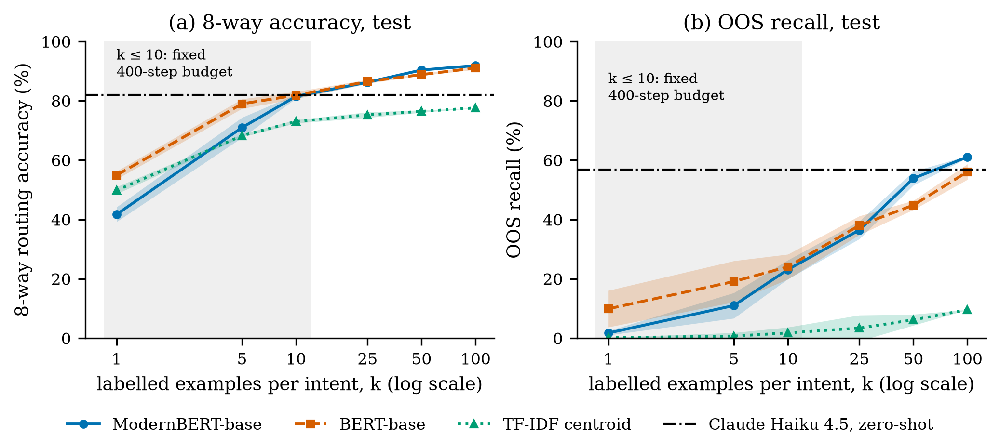
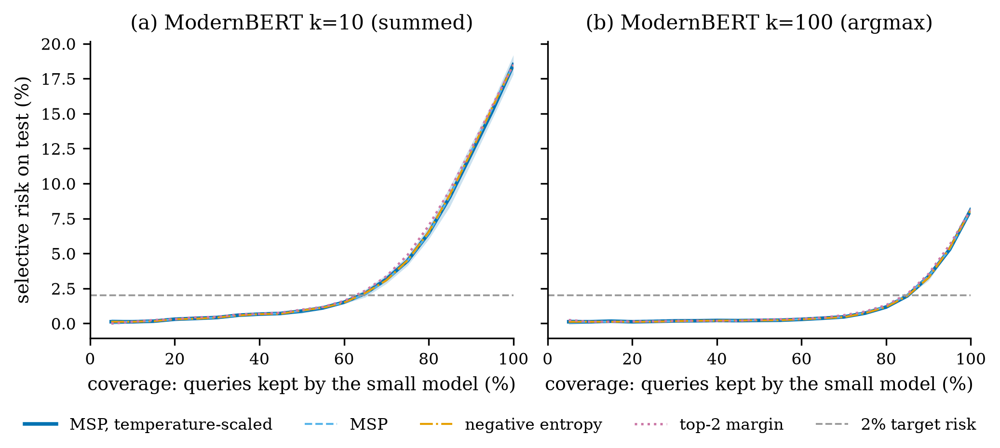
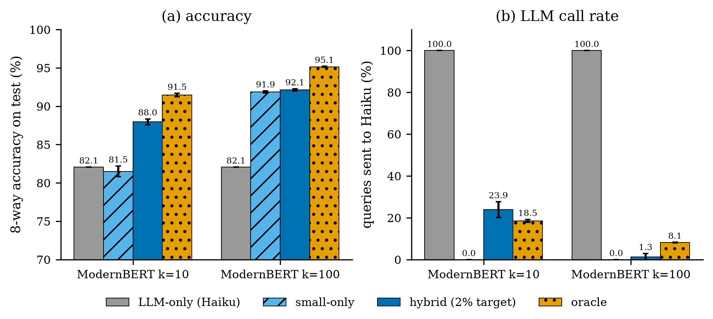
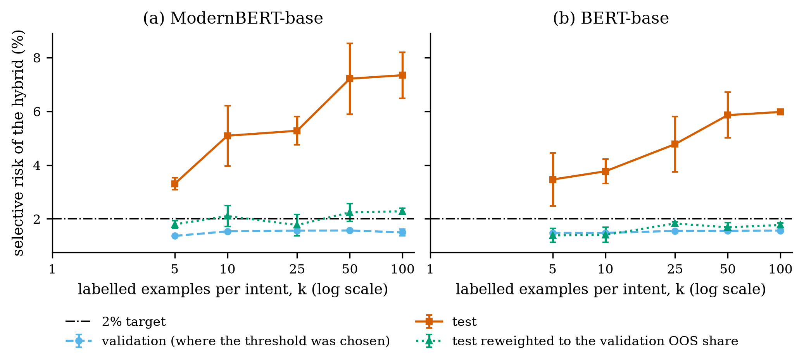

# TinyRouter

[](https://github.com/drewOrc/tinyrouter/actions/workflows/ci.yml)

A small fine-tuned encoder that routes CLINC150 queries to 7 agents (or out-of-scope) on a laptop in milliseconds, calibrated so it can hand the queries it is unsure about to Claude Haiku.

## Results

<!-- BEGIN GENERATED by `make report` from results/*.json; do not edit by hand -->
Test split, 8-way routing (7 agents + out-of-scope), mean ± std over seeds 42, 43, 44.

| What transferred | What did not transfer |
|---|---|
| ModernBERT-base fine-tuned on all 100 examples per intent routes 91.9 ± 0.1% of test queries correctly in the 8-way space (Claude Haiku 4.5 zero-shot: 82.1%). | The deferral threshold chosen on validation for 2% selective risk gives 7.34 ± 0.86% selective risk on test (ModernBERT k=100; validation: 1.50 ± 0.13%). |
| With 10 examples per intent, deferring low-confidence queries to Haiku lifts 8-way accuracy from 81.5 ± 0.7% (small model alone) to 88.0 ± 0.4%, with Haiku called on 23.9 ± 3.8% of queries. | Validation is 3.2% OOS and test 18.2%. Under this reweighting diagnostic, the OOS prior shift contributes about 87% of the observed risk gap; the remaining difference is consistent with a higher conditional error rate on test OOS queries that the model keeps (36.5 ± 3.0% vs 19.9 ± 2.9% on validation). |

**Engineering conclusion.** A deferral threshold has to be calibrated on labelled data that represents the traffic it will see. A benchmark's validation split is not a risk guarantee for production.

**How to read the hybrid.** With few labels the fallback is worth the most: at k=10 it is the best evidence for the cascade (numbers above). With enough labels the local model covers almost all traffic: at k=100 the hybrid sends 1.3 ± 1.6% of test queries to Haiku (170, 9, 31 of 5,500 for seeds 42, 43, 44) and moves 8-way accuracy from 91.9 ± 0.1% to 92.1 ± 0.1%. There the fallback is a small safety and diagnostic lever, not the main source of accuracy.

### Routers (test, 8-way)

| router | 8-way acc (%) | OOS recall (%) | high-confidence OOS misroute (%) | Haiku calls (%) | Haiku US$ per 1K queries |
|---|---|---|---|---|---|
| LLM-only (Haiku 4.5) | 82.1 | 56.8 | n/a | 100.0 | 0.369 |
| ModernBERT k=10, small-only | 81.5 ± 0.7 | 23.1 ± 3.2 | 76.9 ± 3.2 | 0.0 ± 0.0 | 0.000 ± 0.000 |
| ModernBERT k=10, hybrid (target 2%) | 88.0 ± 0.4 | 53.5 ± 1.5 | 15.4 ± 4.7 | 23.9 ± 3.8 | 0.088 ± 0.014 |
| ModernBERT k=10, oracle (upper bound) | 91.5 ± 0.2 | 61.2 ± 0.7 | 0.0 ± 0.0 | 18.5 ± 0.7 | 0.068 ± 0.003 |
| ModernBERT k=100, small-only | 91.9 ± 0.1 | 61.1 ± 0.4 | 38.9 ± 0.4 | 0.0 ± 0.0 | 0.000 ± 0.000 |
| ModernBERT k=100, hybrid (target 2%) | 92.1 ± 0.1 | 62.4 ± 1.3 | 34.5 ± 5.5 | 1.3 ± 1.6 | 0.005 ± 0.006 |
| ModernBERT k=100, oracle (upper bound) | 95.1 ± 0.1 | 75.6 ± 0.6 | 0.0 ± 0.0 | 8.1 ± 0.1 | 0.030 ± 0.000 |

### Efficiency (AC5)

| | BERT-base (historical baseline) | ModernBERT-base (main model) | Claude Haiku 4.5 |
|---|---|---|---|
| parameters | 109.6M | 149.7M | n/a |
| training time, k=100 (Apple M4, MPS) | 852 ± 33 s | 1,198 ± 1 s | none (zero-shot) |
| training peak memory, k=100 (MPS driver, sampled) | 4.31 ± 0.03 GiB | 6.24 ± 0.60 GiB | n/a |
| 8-way accuracy, test (%) | 91.1 ± 0.5 | 91.9 ± 0.1 | 82.1 |
| OOS recall, test (%) | 56.1 ± 2.6 | 61.1 ± 0.4 | 56.8 |
| ECE 151-way, test, before → after temperature (%) | 3.90 ± 0.34 → 3.80 ± 0.44 | 3.95 ± 0.20 → 2.45 ± 0.29 | n/a |
| latency p50 / p95, batch 1 | 15.6 / 17.0 ms | 20.2 / 23.2 ms | 669 / 916 ms (API, incl. network) |

Encoder latency: Apple M4 CPU, batch 1, 4 threads, torch 2.14.0, `torch.inference_mode()`, 50 warm-up queries, then validation rows 0 to 499, in order; tokenization + forward + argmax. It is timed with the same architecture, not the fine-tuned weights (deleted to save disk): the pinned pretrained backbone, a 151-way head, the same tokenizer and max_length. Latency depends on shapes, not weight values, and the parameter count equals the trained run's. Haiku: client-side time per call on the 5,500 test queries, including the network round trip, with up to 6 calls in flight. Peak memory samples `torch.mps.driver_allocated_memory()` after each backward pass and optimizer step (includes the allocator cache). Accuracy, OOS recall and ECE use the 8-way aggregation chosen on validation. Values are mean ± std over seeds 42, 43, 44.

### Cost (RQ5)

Measured: Haiku costs US$0.369 per 1K test queries (340.2K input and 5.89K output tokens per 1K; the whole run of 8,600 calls cost US$3.18). One ModernBERT training run takes 3.3 min at k=10 and 20.0 min at k=100 on an Apple M4.

Break-even queries against LLM-only, for **assumed** accelerator prices (training only, no labelling cost, local inference priced as below). A scenario sensitivity, not a forecast:

| point | router | at US$0.5/h | at US$1/h | at US$2/h |
|---|---|---|---|---|
| ModernBERT k=10 | small-only | 75 | 151 | 302 |
| ModernBERT k=10 | hybrid | 99 | 198 | 396 |
| ModernBERT k=100 | small-only | 452 | 904 | 1,807 |
| ModernBERT k=100 | hybrid | 458 | 915 | 1,830 |

Break-even compares cost only: at k=10 the small model alone is less accurate than Haiku and the hybrid is more accurate than Haiku (router table).

Training compute costs cents; labelling dominates once it has to be paid for. CLINC150 is an existing dataset, so labelling cost is an assumed sensitivity only (break-even queries, training plus labelling):

| hybrid, US$1/h | labelled rows | at US$0.05 per label | at US$0.2 per label | at US$1 per label |
|---|---|---|---|---|
| ModernBERT-base k=10 | 1,525 | 272,097 | 1,087,794 | 5,438,179 |
| ModernBERT-base k=100 | 15,250 | 2,097,550 | 8,387,456 | 41,933,620 |

Local inference is assumed to cost US$0.05 per vCPU-hour at full utilisation, times the measured p50 latency and thread count. Full grid and every input: `results/cost/cost.json`.

**8-way aggregation.** The model predicts 151 intents. Two ways map that to 8 agents: take the argmax intent and map it (`argmax`), or sum the probabilities per agent and take the largest (`summed`). Each run picks one by validation 8-way accuracy only (ties go to argmax). BERT-base: k=1 summed, k=5 summed, k=10 per seed summed/argmax/argmax, k=25 argmax, k=50 per seed summed/summed/argmax, k=100 per seed argmax/summed/argmax. ModernBERT-base: k=1 summed, k=5 summed, k=10 summed, k=25 per seed summed/argmax/summed, k=50 argmax, k=100 argmax.

### Figures



*Test 8-way accuracy and OOS recall against labelled examples per intent (log scale), small model alone, 8-way aggregation chosen on validation; bands are mean ± std over three seeds. The dash-dot line is Claude Haiku 4.5 zero-shot on the same queries. Shaded: k ≤ 10 trains for the fixed 400-step budget.*



*Test selective risk (8-way error among the queries the small model keeps) against coverage, for ModernBERT at k=10 and k=100, for each confidence signal; the band is the std of the temperature-scaled MSP, the main signal. The four signals nearly coincide.*



*Test 8-way accuracy and share of queries sent to Haiku for LLM-only, small-only, the hybrid (threshold chosen on validation for 2% selective risk) and the oracle, which defers exactly the small model's errors. Error bars are std over three seeds.*



*Selective risk of the hybrid whose threshold was chosen on validation for 2% risk: on validation, on test, and on test reweighted to the validation OOS share (a diagnostic, not a method). Points appear where all three seeds had a feasible threshold.*

## Limitations

- **Hyperparameters at the edge of their grids.** The validation pilots chose values at the upper end: learning rate 5e-05 is the top of {1e-05, 2e-05, 5e-05}; S_min 400 is the top of {100, 200, 400}. A better value may lie beyond.
- **Small k is a fixed step budget.** k in {1, 5, 10} trains for S_min = 400 steps (more than 5 epochs), so those points show performance at that budget.
- **Latency uses the same architecture, not the trained weights** (see the efficiency table note).
- **Validation thresholds do not transfer** to test (headline above).
- **One benchmark.** CLINC150, English, one domain mix; BANKING77-OOS is planned for v0.2.
- Training on Apple MPS is not bit-for-bit deterministic, hence three seeds.
<!-- END GENERATED -->

### Privacy of the stored LLM replies

The `haiku-predictions` Release stores, for every query, a SHA-256 of the query text, Haiku's reply, token counts and latency. That is fine here because every query is public CLINC150 text. The same journal design should not be copied unchanged into a product that sees private queries: a hash of a short, guessable query can be reversed by hashing candidates, and replies can echo what the user wrote. There it needs a retention limit, a keyed hash or no query identifier at all, and access control.

## Quick start

Needs [uv](https://docs.astral.sh/uv/) and `make`. uv installs Python 3.12 itself; the system Python version does not matter.

```bash
make setup   # symlinks .venv and checkpoints into *.nosync dirs, then uv sync --locked
make test    # offline unit tests
make smoke   # downloads CLINC150 (~0.5 MB) and a ~1 MB random BERT, trains 1 step on CPU, scores it
```

The first `make setup` downloads torch (about 1 GB installed). After that, `make test` and `make smoke` each take seconds.

Other targets:

| target | what it does |
|---|---|
| `make lint` | ruff check, ruff format check, em dash check |
| `make test-network` | tests that download from the Hugging Face Hub (dataset checksums) |
| `make train CONFIG=configs/bert-base.yaml SEED=42` | fine-tune; final weights in `checkpoints/<run>/final` |
| `make evaluate CONFIG=... SEED=...` | score validation and test, write `results/runs/<run>.json` and the logits archive |
| `make ac2` | bert-base-uncased, full data, seeds 42/43/44; writes `results/ac2.json`, exits 1 on FAIL; resumes only runs made with the current config, `FORCE=1` clears and reruns all three, including deleting seed 42's kept weights; after `make clean-checkpoints` only `FORCE=1` brings seed 42's weights back |
| `make pilot-lr` | validation-only pilot: each encoder at k=100, seed 42, lr in {1e-5, 2e-5, 5e-5}; writes `results/pilots/lr.json` and prints the choice (BERT at 5e-5 reuses AC2 seed 42 when it is the same run) |
| `make pilot-steps` | validation-only pilot: both encoders at k=5, seed 42, S_min in {100, 200, 400}; writes `results/pilots/steps.json`. Needs the learning rates in `configs/curve.yaml` |
| `make baselines` | majority-class and TF-IDF centroid baselines on every (k, seed) sample, archived like an encoder run |
| `make curve MODEL=bert\|modernbert` | baselines, then 6 values of k x 3 seeds with the lr and S_min from `configs/curve.yaml`; writes `results/curves/<model>.json`; keeps no weights |
| `make oos-ablation` | ModernBERT, k=100, no OOS training rows, 3 seeds; writes `results/curves/oos-ablation.json` |
| `make llm-smoke` | Claude Haiku on validation rows 0-19 (needs `ANTHROPIC_API_KEY`); writes `results/llm-smoke/`, prints tokens, cost and the extrapolated cost of all 8,600 rows |
| `make llm` | Claude Haiku on validation 3,100 + test 5,500 in the 8-way space, one stored record per query; resumes; stops before passing `MAX_USD` (default 5); writes `results/llm/haiku-8way.{jsonl,json}` and `results/llm-manifest.json` |
| `make verify-llm` | check `results/llm/haiku-8way.jsonl`: every row once, SHA-256 equal in the file, the summary and the manifest |
| `make verify-logits` | check every archive in `results/logits/` against `results/logits-manifest.json` |
| `make analysis` | RQ2 to RQ4 from the stored logits and Haiku predictions, no training and no API calls; every temperature, aggregation, threshold and signal is chosen on validation; writes `results/analysis/{summary,curves,haiku}.json` and ends with `completed analysis (75/75 archives, 8600/8600 llm rows, 25 groups)` |
| `make bench-cpu` | CPU batch-1 latency of both encoders on validation rows 0-499 (4 threads, 50 warm-up queries), with the pinned pretrained backbone and a 151-way head; stops unless the parameter count equals the trained k=100 run's; writes `results/efficiency/cpu_latency.json` |
| `make llm-latency` | Haiku's per-call latency from `results/llm/haiku-8way.jsonl`; writes `results/efficiency/haiku_latency.json` |
| `make cost` | RQ5 from committed JSON: measured training time, latency and Haiku spend, assumed prices, break-even per scenario; writes `results/cost/cost.json` |
| `make figures` | the four README figures from `results/analysis/*.json`; writes `results/figures/*.png` (byte-identical on rerun with the same matplotlib) |
| `make report` | `results/report.md` and the generated block of this README, from committed JSON; `tests/test_report.py` fails when either is stale |
| `make clean-checkpoints` | delete all trained weights |

Run every target from the repository root: `checkpoint_root` and `results_root` in the configs are relative paths.

There is no default target: a bare `make`, or a quoted `make "curve MODEL=bert"` (one argument: GNU make 3.81, the macOS default, reads it as a variable assignment and used to run `make setup` and exit 0; make 4.x reads it as an unknown target), stops with an error.

**How to tell a curve finished.** Not from the exit code alone. `make baselines`, `make curve` and `make oos-ablation` end with one line that is printed only after the index was read back from disk and checked: exactly the expected points, each once, and every archive's SHA-256 equal on disk, in the manifest and in the index. Match the whole line: `completed 36/36 baseline points`, `completed 18/18 encoder points (bert)` (or `(modernbert)`), `completed 3/3 ablation points`. `make curve` runs the baselines first and prints their `completed 36/36 baseline points` before any encoder point, so a curve that fails afterwards still has a line starting with `completed` in its output; grepping for `completed` alone is not enough.

**Tuning after an AC2 FAIL uses validation only.** `results/ac2.json` and the `make ac2` printout list each seed's validation in-scope accuracy, 8-way accuracy and OOS recall for that purpose; the test numbers are the verdict and are not looked at while choosing hyperparameters.

Put `HF_TOKEN` and `ANTHROPIC_API_KEY` in a `.env` (copy `.env.example`) if you need them; the Makefile passes it to `uv run`. Nothing in the tests or the smoke run calls a paid API.

## How it works

- **Labels.** The model is trained on all 151 CLINC150 intents (150 plus `oos`). Each intent maps to one of 8 routing targets (7 agents plus `oos`) through `src/tinyrouter/resources/intent_to_agent.json`.
- **Data.** `clinc/clinc_oos`, `plus` config, from the Hugging Face Hub at a pinned commit. Each parquet file is checked against its SHA-256 and row count (15,250 / 3,100 / 5,500), and the label names inside it must match the committed `intent_names.json`.
- **Calibration.** Temperature scaling, fitted on validation logits only. `fit_temperature` raises `LeakageError` if given anything else, and a test checks that.
- **Logits archive.** Every evaluation stores per-example validation and test logits (float32) with gold labels and metadata (model and revision, seed, k, OOS training rows, dataset revision and the SHA-256 of the three split files, label-space hash, git commit, time) in `results/logits/<run>.npz`. Later analysis reads only these files. They are not committed (about 5 MB per bert-base run); their SHA-256 goes into the committed `results/logits-manifest.json`, and the files are attached to a GitHub Release.
- **Training cost.** Each results JSON records parameter counts, training wall time, steps, device and peak memory. How memory is measured depends on the device (sampled Metal driver memory on MPS, the allocator peak on CUDA, process peak RSS on CPU) and is written next to the number; see `src/tinyrouter/efficiency.py`.
- **Learning-curve protocol.** Each curve point trains for max(S_min, 5 epochs) steps. The learning rate of each encoder and the one S_min are chosen by validation-only pilots (`docs/PLAN.md` section 4.1) and written into `configs/curve.yaml` by hand. The pilot code raises `LeakageError` if handed the test split.
- **Metrics.** 8-way accuracy, 150-way in-scope accuracy and OOS recall (as defined in Larson et al. 2019), ECE, and NLL. They are computed before and after calibration on both splits. `wilson_interval` gives the confidence interval for OOS recall.

## Layout

```
configs/            run configs (bert-base.yaml, modernbert-base.yaml, smoke.yaml; unknown keys
                    are an error) and curve.yaml, the pilot-chosen lr and S_min
docs/PLAN.md        research questions and acceptance criteria
docs/OPERATIONS.md  CI jobs, branch protection, rollback
scripts/            check_em_dash.py; compat_trial.py and export_onnx.py (encoder trial runs)
src/tinyrouter/
  data.py           pinned download, checksum, per-intent subsampling
  labels.py         151 intents <-> 8 routing targets
  metrics.py        accuracy, in-scope accuracy, OOS recall, ECE, NLL
  calibrate.py      temperature scaling (validation only)
  train.py          HF Trainer wrapper, device auto-select (cuda > mps > cpu)
  evaluate.py       logits, temperature fit, metrics, results JSON
  archive.py        per-example logits archive (.npz) and SHA-256 manifest
  efficiency.py     parameter counts, wall time, peak memory per device
  sampling.py       k-shot training samples (k per intent, ceil(2.5k) oos from a fixed table)
  steps.py          training steps = max(S_min, epoch steps), checked after training
  runs.py           resume rules and when an existing run counts as the same run
  protocol.py       configs/curve.yaml: pilot-chosen lr per encoder and S_min
  pilots.py         validation-only lr and S_min pilots
  curves.py         learning curves and the OOS ablation (reuses AC2 at k=100 when equivalent)
  baselines.py      majority-class and TF-IDF centroid baselines per curve point
  ac2.py            AC2 run over three seeds and PASS/FAIL verdict
  llm.py            Claude Haiku zero-shot router: prompt, retries, pricing (baseline and fallback)
  llm_run.py        Haiku over validation + test: journal, resume, cost cap, completion check
  selective.py      AURC, risk-coverage, AUROC, AUPRC, Wilson-bound threshold choice (validation only)
  haiku.py          stored Haiku predictions as arrays; old and new reply parsers
  analysis.py       one archive: 8-way aggregation, OOS, signals, ECE, fallback, oracle
  diagnostics.py    why validation thresholds miss the target on test (OOS share, reweighting)
  analysis_run.py   `make analysis`: completion checks, label cross-checks, mean and std over seeds
  latency.py        CPU batch-1 latency of the encoders; Haiku latency from the journal
  cost.py           RQ5: measured costs, assumed prices, break-even
  figures.py        README figures from results/analysis/*.json
  report.py         results/*.json -> results/report.md and the README's generated block
  smoke.py          end-to-end wiring check
tests/              pytest; `network` marker for Hub downloads
```

## Why `.venv` and `checkpoints` are symlinks (iCloud)

This repository sits in a folder synced by iCloud Drive. iCloud would otherwise try to upload the virtualenv (about 1 GB of torch) and every checkpoint (about 440 MB per bert-base run), and it can evict local files to save space in the middle of a run. iCloud skips any path ending in `.nosync`, so `make setup` creates `.venv.nosync/` and `checkpoints.nosync/` and puts symlinks at `.venv` and `checkpoints`. uv and the training code use the usual names and never notice. If you clone this somewhere outside iCloud, the symlinks do no harm.

Disk is also tight, so training keeps at most one checkpoint (`save_total_limit=1`) and deletes it once the final weights are saved. `make ac2` also deletes the weights of seeds 43 and 44 after their logits are archived; only seed 42's are kept.

## Reproducibility notes

- Every direct dependency is pinned exactly in `pyproject.toml`; `uv.lock` pins the rest.
- Seeds default to 42. Results are reported over three seeds (42, 43, 44).
- Training on Apple MPS is not bit-for-bit deterministic even with a fixed seed. That is why results are reported as mean ± std over seeds rather than as one run.

## License

MIT, see `LICENSE`. CLINC150 is released by its authors under CC BY 3.0.
